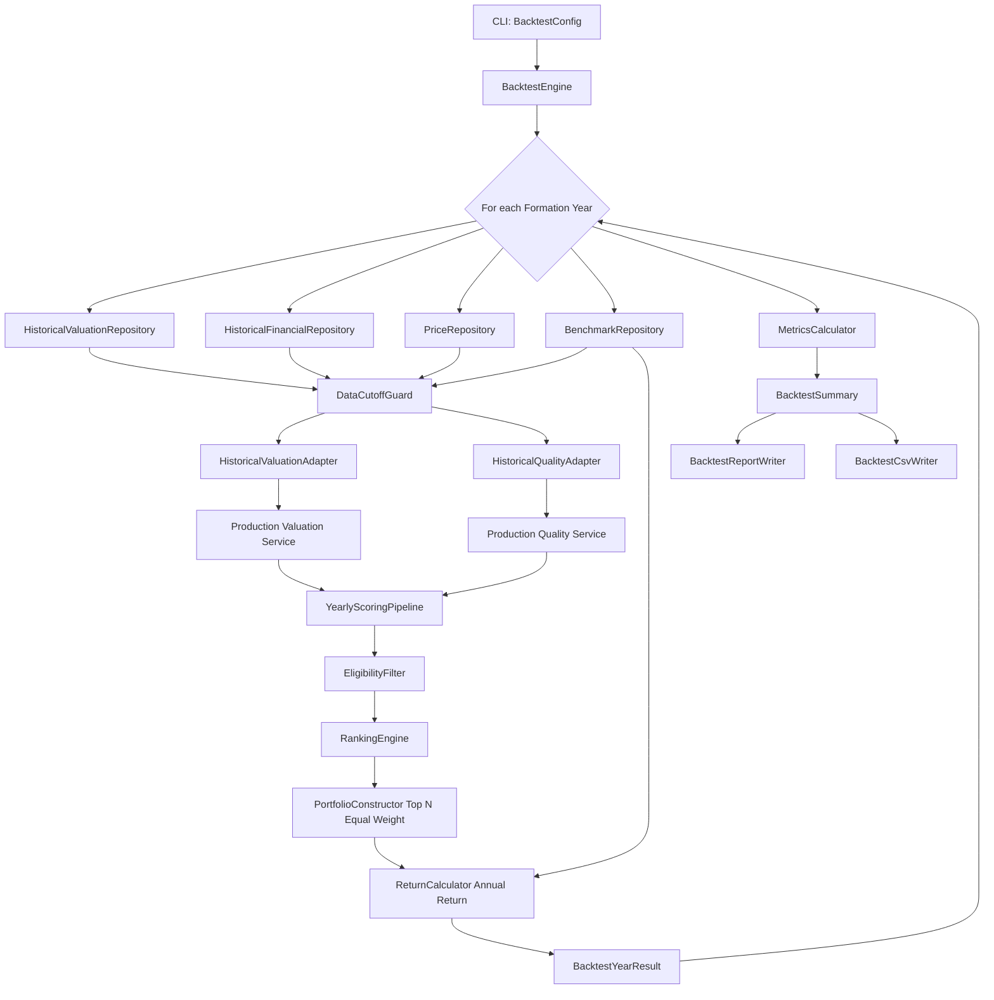

# QVM Backtesting Module and Class Design (MVP)

## Goal
Define a minimal, reusable historical backtesting architecture for QVM (Quality + Valuation), reusing production scoring logic and excluding momentum for MVP.

## Design Constraints
- Reuse production valuation and quality formulas.
- Historical layer only loads and filters data.
- Enforce formation-year cutoff invariant everywhere.
- Keep annual rebalance workflow simple and deterministic.

## Proposed Module Layout

```text
src/
  quantlab/
    strategies/
      qvm/
        backtest/
          domain/
            models.py
          repositories/
            valuation_repo.py
            financial_repo.py
            price_repo.py
            benchmark_repo.py
            cutoff_guard.py
          adapters/
            valuation_adapter.py
            quality_adapter.py
          pipeline/
            yearly_scoring.py
            eligibility.py
            ranking.py
            portfolio.py
            returns.py
            metrics.py
            engine.py
          reporting/
            report_writer.py
            csv_writer.py
  qvm_lab/
    backtest_cli.py
```

## Domain Models
- `FormationContext`: formation year, rebalance date, lookback years, top N.
- `CompanySnapshot`: ticker + valuation facts + quality facts + scores.
- `EligibilityResult`: eligible flag + exclusion reason(s).
- `RankedCompany`: ticker + score + rank.
- `PortfolioYear`: year + holdings + weights.
- `BacktestYearResult`: portfolio return, benchmark return, excess return.
- `BacktestSummary`: CAGR, vol, Sharpe, drawdown, win rate.

## Repository Layer
- `DataCutoffGuard`
  - `assert_no_future_rows(..., formation_year)`
  - Shared invariant check.
- `HistoricalValuationRepository`
  - Returns PE history up to formation year.
- `HistoricalFinancialRepository`
  - Returns Y-1 fundamentals for formation year.
- `PriceRepository`
  - Returns adjusted close for assets.
- `BenchmarkRepository`
  - Returns adjusted close for SPY.

## Adapter Layer
- `HistoricalValuationAdapter`
  - Converts historical PE data into production valuation input model.
- `HistoricalQualityAdapter`
  - Converts Y-1 fundamentals into production quality input model.

## Pipeline Layer
- `YearlyScoringPipeline`
  - Scores all companies for one formation year using production services.
- `EligibilityFilter`
  - Applies minimum quality coverage (75%) and minimum PE observations (5).
- `RankingEngine`
  - Reuses existing ranking logic for eligible companies.
- `PortfolioConstructor`
  - Builds equal-weight Top N portfolio.
- `ReturnCalculator`
  - Computes annual portfolio and SPY returns from adjusted close.
- `MetricsCalculator`
  - Computes aggregate metrics.
- `BacktestEngine`
  - Orchestrates multi-year run.

## Reporting Layer
- `BacktestReportWriter`
  - Writes concise text summary.
- `BacktestCsvWriter`
  - Writes yearly and summary CSV outputs.

## End-to-End Flow



## Class Relationship View

```mermaid
classDiagram
    class FormationContext {
      +int formation_year
      +date rebalance_date
      +int lookback_years
      +int top_n
    }

    class CompanySnapshot {
      +str ticker
      +float valuation_score
      +float quality_score
      +float overall_score
      +float quality_coverage
      +int pe_observations
    }

    class EligibilityResult {
      +bool eligible
      +list reasons
    }

    class RankedCompany {
      +str ticker
      +int rank
      +float overall_score
    }

    class PortfolioYear {
      +int year
      +list holdings
      +dict weights
    }

    class BacktestYearResult {
      +int year
      +float portfolio_return
      +float benchmark_return
      +float excess_return
    }

    class BacktestSummary {
      +float cagr
      +float volatility
      +float sharpe
      +float max_drawdown
      +float win_rate_vs_benchmark
    }

    class DataCutoffGuard {
      +assert_no_future_rows(data, formation_year)
    }

    class HistoricalValuationRepository {
      +get_pe_history(ticker, formation_year)
    }

    class HistoricalFinancialRepository {
      +get_financial_snapshot_y_minus_1(ticker, formation_year)
    }

    class PriceRepository {
      +get_adjusted_close(ticker, start_date, end_date)
    }

    class BenchmarkRepository {
      +get_spy_adjusted_close(start_date, end_date)
    }

    class HistoricalValuationAdapter {
      +build_valuation_input(pe_history)
    }

    class HistoricalQualityAdapter {
      +build_quality_input(financial_snapshot)
    }

    class YearlyScoringPipeline {
      +score_universe(ctx)
    }

    class EligibilityFilter {
      +apply(snapshots)
    }

    class RankingEngine {
      +rank(eligible_snapshots)
    }

    class PortfolioConstructor {
      +build_equal_weight_top_n(ranked, top_n)
    }

    class ReturnCalculator {
      +compute_annual_return(portfolio_year)
    }

    class MetricsCalculator {
      +summarize(year_results)
    }

    class BacktestEngine {
      +run(start_year, end_year, top_n)
    }

    class BacktestReportWriter {
      +write_text(summary, year_results, output_path)
    }

    class BacktestCsvWriter {
      +write_csv(summary, year_results, output_dir)
    }

    HistoricalValuationRepository --> DataCutoffGuard
    HistoricalFinancialRepository --> DataCutoffGuard
    PriceRepository --> DataCutoffGuard
    BenchmarkRepository --> DataCutoffGuard

    HistoricalValuationAdapter --> HistoricalValuationRepository
    HistoricalQualityAdapter --> HistoricalFinancialRepository

    YearlyScoringPipeline --> HistoricalValuationAdapter
    YearlyScoringPipeline --> HistoricalQualityAdapter
    YearlyScoringPipeline --> CompanySnapshot

    EligibilityFilter --> CompanySnapshot
    EligibilityFilter --> EligibilityResult
    RankingEngine --> CompanySnapshot
    RankingEngine --> RankedCompany

    PortfolioConstructor --> RankedCompany
    PortfolioConstructor --> PortfolioYear

    ReturnCalculator --> PortfolioYear
    ReturnCalculator --> BenchmarkRepository
    ReturnCalculator --> BacktestYearResult

    MetricsCalculator --> BacktestYearResult
    MetricsCalculator --> BacktestSummary

    BacktestEngine --> FormationContext
    BacktestEngine --> YearlyScoringPipeline
    BacktestEngine --> EligibilityFilter
    BacktestEngine --> RankingEngine
    BacktestEngine --> PortfolioConstructor
    BacktestEngine --> ReturnCalculator
    BacktestEngine --> MetricsCalculator
    BacktestEngine --> BacktestReportWriter
    BacktestEngine --> BacktestCsvWriter
```



## Implementation Order
1. Domain models + interfaces
2. Repositories + cutoff guard
3. Adapters + yearly scoring
4. Eligibility + ranking
5. Portfolio + returns + benchmark
6. Metrics + reporting + CLI

## Acceptance Checks
- No data newer than formation year is consumed.
- Y-1 fundamentals rule is enforced.
- Eligibility thresholds applied before ranking.
- Portfolio uses equal-weight Top N and annual rebalance.
- Outputs reproducible for fixed inputs.
